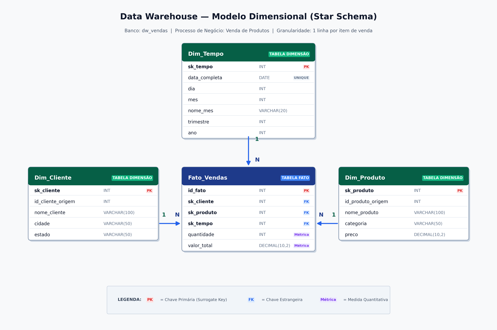

# Data Warehouse & ETL: De Silos Operacionais (OLTP) ao Esquema Estrela (OLAP)

> **Disciplina:** Tópicos Especiais em Banco de Dados  
> **Instituição:** Universidade do Estado da Bahia (UNEB)  
> **Atividade 1:** Modelagem Dimensional, Pipeline de ETL e Análise de Dados  

---

## 📌 Visão Geral

Este repositório contém a implementação completa de um **Data Warehouse (DW)** para consolidação e análise do processo de negócio de **Vendas**, integrando bancos relacionais transacionais (OLTP) heterogêneos em um modelo dimensional **Star Schema (Esquema Estrela)**, acompanhado de pipeline **ETL (Extract, Transform, Load)** e dashboards interativos no **Metabase**.

### Pilares Conceituais Aplicados:
* **Orientação por Assunto:** Isolamento do processo analítico de vendas no banco `dw_vendas`.
* **Integração:** Padronização e resolução de dados de clientes, produtos e transações.
* **Não-Volatilidade:** Dados carregados como registros históricos consolidados.
* **Variação Temporal:** Granularidade diária decomposta em dimensões temporais analíticas (dia, mês, trimestre, ano).
* **Surrogate Keys (SK):** Desacoplamento entre os identificadores naturais dos sistemas operacionais e o modelo analítico.

---

## 🏛️ Modelo Dimensional (Star Schema)

A modelagem dimensional foi desenhada com foco na granularidade de **cada transação de venda individual**, estruturada em torno da tabela fato central conectada a três dimensões:



### Estrutura das Tabelas:

1. **`Dim_Tempo` (Dimensão Temporal):**
   * Chave Primária: `sk_tempo` (Surrogate Key, INT AUTO_INCREMENT).
   * Atributos: `data_completa` (UNIQUE), `dia`, `mes`, `nome_mes`, `trimestre`, `ano`.
2. **`Dim_Cliente` (Dimensão de Clientes):**
   * Chave Primária: `sk_cliente` (Surrogate Key, INT AUTO_INCREMENT).
   * Atributos: `id_cliente_origem` (rastreabilidade OLTP), `nome_cliente`, `cidade`, `estado`.
3. **`Dim_Produto` (Dimensão de Produtos):**
   * Chave Primária: `sk_produto` (Surrogate Key, INT AUTO_INCREMENT).
   * Atributos: `id_produto_origem` (rastreabilidade OLTP), `nome_produto`, `categoria`, `preco`.
4. **`Fato_Vendas` (Tabela Fato Central):**
   * Chave Primária: `id_fato` (INT AUTO_INCREMENT).
   * Chaves Estrangeiras: `sk_tempo`, `sk_cliente`, `sk_produto`.
   * Métricas Aditivas: `quantidade` (unidades vendidas) e `valor_total` (faturamento em R$).

---

## 🚀 Execução Rápida via Docker (Zero-Touch)

O ambiente foi totalmente conteinerizado com **Docker Compose**, unindo o **MySQL 8.0** e o **Metabase**. A inicialização é **100% automatizada**: ao subir o container, o banco transacional é carregado, o DW é criado e populado, e o Metabase já conecta aos dashboards prontos.

### 1. Iniciar o ambiente

```bash
cd docker/
docker compose up -d
```

### 2. O que acontece automaticamente na primeira execução:
1. `init/01_oltp.sql`: Cria e popula as bases relacionais operacionais (`vendas_db`, `logistica_db`, `financeiro_db`).
2. `init/02_dados_extras.sql`: Injeta massa histórica volumosa (3.000 transações de 2024 a 2026 e 300 clientes).
3. `init/03_criar_dw.sql`: Executa o DDL criando o banco `dw_vendas` e as tabelas dimensionais.
4. `init/04_etl_carga.sql`: Executa o pipeline de ETL resolvendo Surrogate Keys via JOINs e validando a integridade.

### 3. Acessar o Dashboard (Metabase)

Abra no navegador: **[http://localhost:3000](http://localhost:3000)**

* **E-mail:** `cerveja123@gmail.com`
* **Senha:** `cerveja123`

O painel já vem pré-configurado com as visualizações das 5 consultas analíticas, filtros e cartões executivos.

---

## 📊 Consultas Analíticas (OLAP via Terminal)

As consultas analíticas oficiais da entrega acadêmica estão localizadas em `solucao/03_consultas_analiticas.sql`.

Para rodar todas as consultas diretamente no banco analítico:

```bash
docker exec -i oltp_dw_mysql mysql -uroot -proot dw_vendas < solucao/03_consultas_analiticas.sql
```

Ou conectar-se interativamente:

```bash
docker exec -it oltp_dw_mysql mysql -uroot -proot dw_vendas
```

### Visões Implementadas:
* **Visão 1 — Total de Vendas por Estado:** Agrupamento por estado do cliente (`Dim_Cliente.estado`), consolidando unidades vendidas e faturamento total.
* **Visão 2 — Total de Vendas por Categoria:** Segmentação por categoria do produto (`Dim_Produto.categoria`), revelando as linhas com maior receita.
* **Visão 3 — Faturamento por Período (Mês e Ano):** Agregação cronológica mensal de 2024 a 2026, permitindo análise de sazonalidade e tendências.
* **Visão 4 (Executiva) — Indicadores Globais:** Cartões com Total de Transações, Unidades Vendidas, Faturamento Total, Ticket Médio e Preço Médio por Item.
* **Visão 5 (Executiva) — Top 10 Produtos Mais Rentáveis:** Ranking dos produtos com maior geração de receita líquida.

---

## 📁 Estrutura do Repositório e Entregáveis

```
atividade_1/
├── README.md                        # Guia principal e documentação do projeto
├── CONTEXTO.md                      # Detalhamento teórico dos silos OLTP e regras de negócio
├── CHECKLIST.md                     # Checklist com status de todas as fases implementadas
├── instrucoes.txt                   # Enunciado oficial da atividade
├── Estudo de Caso 1_v2.html         # Material de apoio visual fornecido pelo professor
├── mysql_operational_dbs.sql        # Script OLTP base original
│
├── solucao/                         # Artefatos oficiais solicitados para entrega
│   ├── 01_criar_dw.sql              # DDL do DW dw_vendas e Star Schema
│   ├── 02_etl_carga.sql             # Pipeline de carga ETL com resolução de SKs
│   ├── 03_consultas_analiticas.sql  # 5 visões analíticas sobre o DW
│   ├── diagrama_star_schema.png     # Diagrama Star Schema em alta resolução (300 DPI)
│   └── diagrama_star_schema.puml    # Código-fonte do diagrama em PlantUML
│
└── docker/                          # Infraestrutura de reprodução do ambiente
    ├── docker-compose.yml           # Orquestração do MySQL 8.0 e Metabase
    ├── README.md                    # Documentação técnica e operacional do ambiente Docker
    ├── metabase-data/               # Base de metadados H2 persistida com os dashboards
    └── init/                        # Carga e setup automático na inicialização do MySQL
        ├── 01_oltp.sql
        ├── 02_dados_extras.sql
        ├── 03_criar_dw.sql
        └── 04_etl_carga.sql
```
