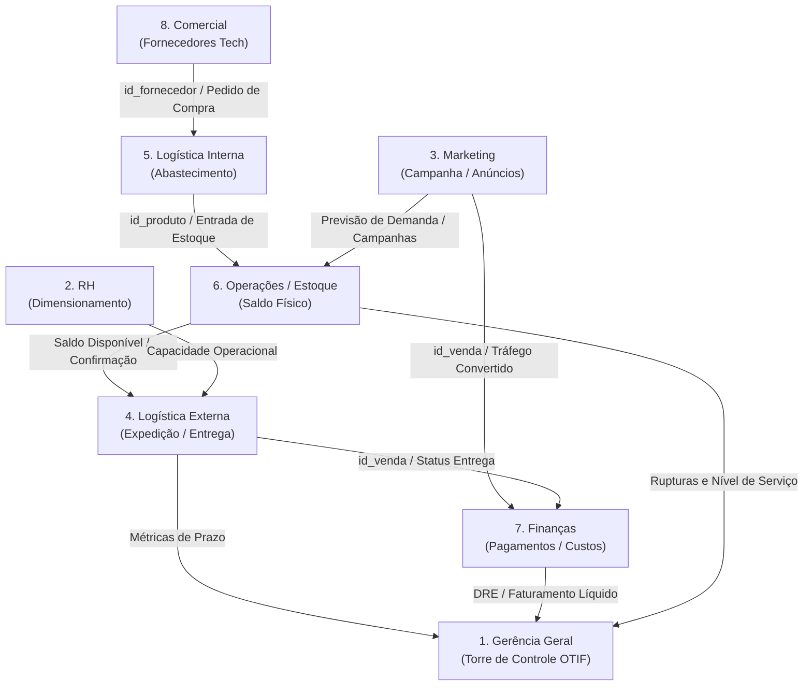

# Contexto do Projeto — Estudo de Caso 1.1

**Disciplina:** Tópicos Especiais em Banco de Dados  
**Instituição:** Universidade do Estado da Bahia (UNEB)  
**Tema:** Mapeamento de Áreas de Convergência (A.C.), Atividades Operacionais, Métricas de Desempenho e Integração Dimensional no E-commerce Tech  

---

## 1. Objetivo da Atividade

O **Estudo de Caso 1.1** evolui a fundamentação do Caso 1 (onde tratamos silos operacionais básicos de vendas) para um cenário corporativo completo e dinâmico, baseado em **Áreas de Convergência (A.C.)** e **Atividades Operacionais Integradas**.

Os três pilares exigidos pelo professor são:
1. **Identificar Atividades Operacionais e Características de Desempenho:** Garantir que todas as **8 Áreas de Convergência** possuam uma atividade operacional bem delineada e, no mínimo, uma métrica/KPI de desempenho mensurável.
2. **Identificar Integrações entre as Áreas de Convergência (A.C.):** Mapear o fluxo de informações, chaves de junção e gatilhos que conectam os diferentes departamentos.
3. **Implementar a Solução no Banco de Dados:** Evoluir a camada operacional (OLTP), conceber o modelo analítico dimensional (Data Warehouse), implementar o pipeline de ETL e as consultas analíticas que calculam os indicadores.

---

## 2. Cenário de Negócio: Mega Campanha Promocional Tech (Black Friday / Flash Sale)

Em sala de aula, o professor apresentou o exemplo didático da campanha de cerveja com entregas rápidas via aplicativo para ilustrar como áreas operacionais convergem. 

Para a nossa entrega prática, adaptamos e contextualizamos o cenário para o **nosso banco de dados real**, que representa um **E-commerce de Tecnologia, Hardware, Periféricos e Móveis Gamer/Escritório**:

- **Catálogo:** Notebooks de alto desempenho, smartphones, placas de vídeo RTX, SSDs, monitores ultrawide, teclados mecânicos, mouses gamer e cadeiras ergonômicas.
- **Ecossistema Operacional:** Rede de fornecedores especializados (`Tech Supplies`, `Componentes Top`, `Eletro Mais`, `Acessórios Express`), controle de estoque com reposição, transportadoras para expedição nacional e conciliação de métodos de pagamento (Pix, Cartão, Boleto) contra despesas operacionais.
- **O Desafio da Campanha:** Um evento promocional de grande escala (Flash Sale / Black Friday Tech) gera um pico simultâneo de pedidos, demandando sincronia em tempo real entre negociação comercial, abastecimento, estoque de segurança, triagem física e faturamento.

---

## 3. As 8 Áreas de Convergência & Atividades Operacionais

Mapeamento completo das 8 Áreas de Convergência, preenchendo tanto as atividades trazidas no quadro quanto as áreas identificadas para o nosso domínio:

| # | Área de Convergência (A.C.) | Atividade Operacional Específica | Escopo no E-commerce de Tecnologia | Característica de Desempenho (Métrica / KPI) |
|:---:|---|---|---|---|
| **1** | **Gerência Geral** | **1.1 Monitoramento de Eficiência Geral e Torre de Controle** | Acompanhamento do nível global de atendimento e cumprimento dos pedidos em tempo hábil. | **Taxa OTIF (%):** *On-Time In-Full* (% de pedidos entregues no prazo acordado e sem pendências) |
| **2** | **RH** | **2.1 Dimensionamento da Equipe de Expedição e Suporte** | Alocação de colaboradores para picking, packing, conferência e suporte ao cliente em períodos de pico. | **Produtividade Operacional:** `Total de Pedidos Despachados / Total de Colaboradores Alocados` |
| **3** | **Marketing** | **3.1 Gestão de Campanhas de Tráfego e Conversão Tech** | Execução de anúncios digitais segmentados para periféricos, componentes e hardware. | **ROAS (Return on Ad Spend):** `Faturamento Bruto Gerado / Despesas com Marketing Digital` |
| **4** | **Logística Ext.** | **4.1 Expedição e Gestão de Despacho de Entregas** | Despacho dos pedidos para as transportadoras e rastreio do cumprimento do frete. | **Lead Time Médio de Entrega:** `AVG(data_entrega - data_venda)` em dias por UF/Região |
| **5** | **Logística Int.** | **5.1 Abastecimento e Entrada de Fornecedores** | Recebimento, descarregamento e triagem de lotes de reposição enviados pelos fornecedores parceiros. | **Tempo Médio de Reposição (Lead Time de Entrada):** `AVG(data_ultima_entrada - data_pedido_fornecedor)` |
| **6** | **Produção / Operações** | **6.1 Gestão de Estoque e Prevenção de Ruptura** | Controle dos níveis de estoque físico para evitar indisponibilidade de itens críticos (placas de vídeo, SSDs). | **Índice de Ruptura de Estoque (Stockout Rate %):** `Produtos com Saldo Crítico / Total de Produtos no Catálogo` |
| **7** | **Finanças** | **7.1 Conciliação Financeira e Margem Líquida** | Apuração da receita por método de pagamento contra custos de produtos e despesas fixas/variáveis. | **Margem de Contribuição Líquida (% e R$):** `(Faturamento - Custos Variáveis - Despesas) / Faturamento` |
| **8** | **Comercial** | **8.1 Homologação e Negociação com Fornecedores** | Credenciamento de novos parceiros e negociação de lotes com preços competitivos para a campanha. | **Grau de Concentração de Fornecimento (%):** `Volume Faturado por Fornecedor / Volume Total Faturado` |

---

## 4. Dicionário Detalhado de Métricas e KPIs (Tarefa 1)

### KPI 1 — Taxa OTIF (On-Time In-Full) [Gerência Geral]
- **Objetivo:** Avaliar a excelência do cumprimento do pedido da compra até o cliente final.
- **Fórmula:** 
  $$\text{OTIF (\%)} = \left( \frac{\text{Qtd. Pedidos com status 'Entregue' no prazo}}{\text{Total de Pedidos Realizados}} \right) \times 100$$
- **Interpretação:** Mede a eficácia ponta a ponta da cadeia.

### KPI 2 — Produtividade de Expedição [RH]
- **Objetivo:** Mensurar a eficiência do dimensionamento humano durante o aumento de demanda da campanha.
- **Fórmula:**
  $$\text{Produtividade} = \frac{\text{Total de Pedidos Expedidos}}{\text{Equipe Operacional Alocada}}$$
- **Interpretação:** Detecta gargalos de capacidade humana na separação física de caixas e pacotes.

### KPI 3 — ROAS da Campanha Tech [Marketing]
- **Objetivo:** Verificar a rentabilidade do investimento em tráfego pago e marketing digital.
- **Fórmula:**
  $$\text{ROAS} = \frac{\sum \text{valor\_total (vendas associadas à campanha)}}{\sum \text{valor (despesas de marketing)}}$$
- **Interpretação:** Um ROAS de 5.0 significa que cada R$ 1,00 investido em marketing gerou R$ 5,00 em faturamento de hardware.

### KPI 4 — Lead Time Médio de Entrega [Logística Externa]
- **Objetivo:** Rastrear a agilidade no deslocamento dos pacotes das centrais para os clientes.
- **Fórmula:**
  $$\text{Lead Time (dias)} = \text{AVG}(\text{data\_entrega} - \text{data\_venda})$$
- **Interpretação:** Segmentável por estado (`UF`), identificando transportadoras e regiões deficitárias.

### KPI 5 — Lead Time de Abastecimento Interno [Logística Interna]
- **Objetivo:** Medir o tempo de resposta da cadeia de suprimentos até o produto estar disponível para separação.
- **Fórmula:**
  $$\text{Tempo de Abastecimento} = \text{data\_ultima\_entrada} - \text{data\_ordem\_compra}$$
- **Interpretação:** Garante que pedidos de compra de componentes críticos cheguem antes do esgotamento das prateleiras.

### KPI 6 — Taxa de Ruptura de Estoque (Stockout Rate) [Produção/Operações]
- **Objetivo:** Medir a perda de oportunidades de venda por ausência de itens físicos.
- **Fórmula:**
  $$\text{Ruptura (\%)} = \left( \frac{\text{Itens com saldo zero ou abaixo do estoque mínimo}}{\text{Total de SKUs ativos no catálogo}} \right) \times 100$$

### KPI 7 — Margem de Contribuição Líquida [Finanças]
- **Objetivo:** Apurar se os descontos agressivos da campanha não comprometeram a saúde financeira do negócio.
- **Fórmula:**
  $$\text{Margem Líquida} = \text{Faturamento Bruto} - \text{Custo de Aquisição} - \text{Despesas Operacionais Rateadas}$$

### KPI 8 — Índice de Concentração de Fornecimento [Comercial]
- **Objetivo:** Mitigar riscos de dependência excessiva de poucos fornecedores de tecnologia.
- **Fórmula:**
  $$\text{Concentração (\%)} = \left( \frac{\text{Estoque ou Receita provida pelo Fornecedor } X}{\text{Total Geral}} \right) \times 100$$

---

## 5. Mapeamento de Integrações entre Áreas de Convergência (Tarefa 2)

As 8 áreas não operam isoladas; elas interagem em tempo real através de conectores de dados e gatilhos de eventos:



### Matriz de Conectores e Gatilhos:

| Origem $\rightarrow$ Destino | Conector / Chave | Gatilho / Evento de Negócio | Impacto no Processamento |
|---|---|---|---|
| **Comercial $\rightarrow$ Logística Int.** | `id_fornecedor`, `id_produto` | Negociação de lote promocional fechada. | Dispara ordem de recebimento no armazém. |
| **Logística Int. $\rightarrow$ Estoque** | `id_produto`, `data_ultima_entrada` | Carga conferida e descarregada nas docas. | Incrementa `quantidade_disponivel` para o site. |
| **Marketing $\rightarrow$ Vendas/Estoque** | `id_produto`, `categoria` | Lançamento de cupom ou anúncio relâmpago. | Aloca reserva de estoque para evitar overselling. |
| **Vendas $\rightarrow$ Logística Ext.** | `id_venda`, `id_cliente` | Pagamento aprovado no gateway. | Gera etiqueta de envio e ordem de picking. |
| **Logística Ext. $\rightarrow$ Finanças** | `id_venda`, `status_entrega` | Pedido marcado como `Entregue` pela transportadora. | Libera conciliação do frete e encerra ciclo contábil. |
| **RH $\rightarrow$ Logística Ext.** | `id_equipe`, `capacidade_expedicao` | Definição de escala de horas extras/turnos extras. | Limita o teto diário de pedidos despachados. |
| **Finanças $\rightarrow$ Gerência Geral** | Período (`mes`/`ano`), Centro de Custo | Fechamento diário de receita vs. despesas. | Alimenta o painel executivo com ROI e Margem Real. |

---

## 6. Arquitetura de Dados Alvo (Tarefa 3)

### Camada Operacional (OLTP Integrado):
- `vendas_db`: `produtos`, `clientes`, `vendas`.
- `logistica_db`: `fornecedores`, `estoque`, `entregas`.
- `financeiro_db`: `pagamentos`, `despesas`.

### Camada Dimensional (DW dw_tech_campaign):
O DW do Caso 1.1 consolida os silos em um modelo multidimensional (Constelação de Fatos) que coloca a **Venda como eixo integrador**, cruzando dados comerciais, logísticos e financeiros:
- **Tabelas Dimensão:**
  - `Dim_Tempo`: Decomposição temporal completa (`sk_tempo`, `data_completa`, `dia`, `mes`, `nome_mes`, `trimestre`, `ano`, `dia_semana`).
  - `Dim_Cliente`: Perfil regional do consumidor (`sk_cliente`, `id_cliente_origem`, `nome_cliente`, `cidade`, `estado`).
  - `Dim_Produto`: Atributos, categorias e faixas de preço (`sk_produto`, `id_produto_origem`, `nome_produto`, `categoria`, `preco`).
  - `Dim_Fornecedor`: Nome, contato e categoria de suprimentos (`sk_fornecedor`, `id_fornecedor_origem`, `nome_fornecedor`, `contato`).
  - `Dim_Entrega`: Status e modalidade de entrega (`sk_entrega`, `id_entrega_origem`, `status_entrega`).
  - `Dim_Pagamento`: Método de pagamento (`sk_pagamento`, `id_pagamento_origem`, `metodo_pagamento`).
- **Tabelas Fato:**
  - `Fato_Vendas_Integrada` (Fato Central):
    - Granularidade: 1 linha por transação individual de venda.
    - Surrogate Keys (FKs): `sk_cliente`, `sk_produto`, `sk_fornecedor`, `sk_tempo_venda`, `sk_tempo_entrega`, `sk_tempo_pagamento`, `sk_entrega`, `sk_pagamento`.
    - Métricas Aditivas e Fatos: `quantidade`, `valor_total_venda`, `valor_pago`, `dias_para_entrega`, `flag_entregue_no_prazo` (1/0).
  - `Fato_Despesas_Operacionais` (Fato Financeiro de Apoio):
    - Granularidade: 1 linha por registro contábil de despesa.
    - Chaves e Atributos: `id_despesa_fato` (PK), `sk_tempo` (FK), `tipo_despesa` (Fixa/Variável), `descricao`, `valor_despesa`.
    - Finalidade: Permitir o cálculo exato do ROAS (Marketing), DRE e Margem Líquida Real (Finanças).

---

## 7. Estrutura de Arquivos do Módulo `caso_1.1/`

```
caso_1.1/
├── CONTEXTO.md                     # Este documento estruturante
├── CHECKLIST.md                    # Plano de execução passo a passo
│
├── solucao/                        # Artefatos executáveis de entrega
│   ├── 01_criar_dw_expandido.sql   # DDL do DW com modelo integrado
│   ├── 02_etl_carga_integrada.sql  # Pipeline ETL integrando os 3 bancos
│   └── 03_consultas_metricas_ac.sql# Queries SQL calculando os 8 KPIs
│
└── diagramas/                      # Artefatos visuais
    ├── mapa_areas_convergencia.puml
    ├── mapa_areas_convergencia.png
    ├── star_schema_integrado.puml
    └── star_schema_integrado.png
```
